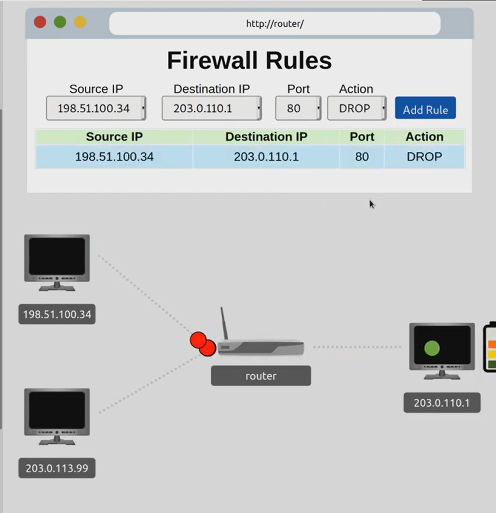
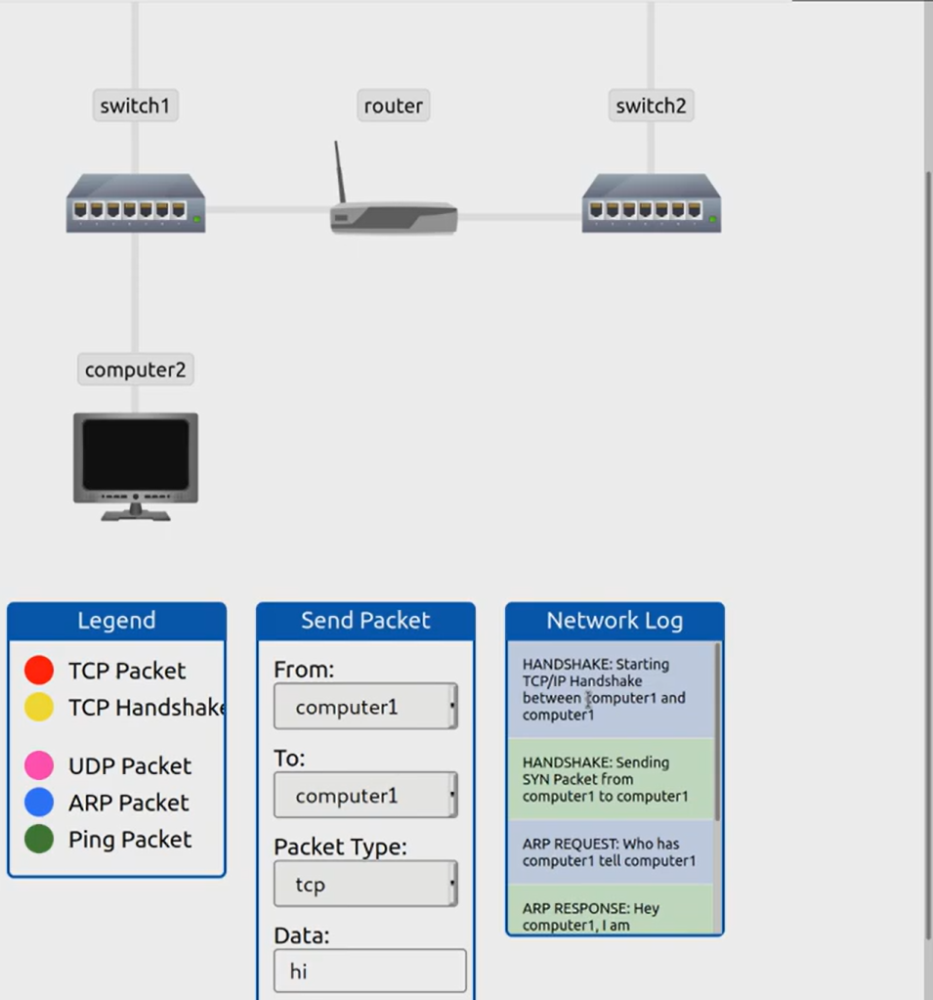

# Room: Extending Your Network  
**Platform:** TryHackMe  
**Difficulty:** Beginner  
**Date Completed:** 13th September 2025  

## 🗒️Room Summary  
In this room I learnt how networks can be made bigger and more secure with switches, routers, VLANs, and firewalls. VLANs split up a network into smaller parts, switches connect devices inside a LAN, routers connect different networks together, and firewalls protect the network by controlling what traffic goes in or out.  

## 🔑Key Takeaways  
- Switches help devices inside a LAN talk to each other.  
- Routers connect different networks with each other.  
- VLANs separate traffic even if devices are on the same switch.  
- Firewalls act like guards that block or allow traffic based on rules.  

## 🖥️Practical Learning  
The practical in this room was about firewalls and routing. I blocked a device that was spamming requests to our server which would cause our server to overload and eventually crash. I also learnt how a packet travels from point 'a' to point 'b' with the most optimal route there would be.
## Some screenshots here    
- Here is how I blocked a device trying to conduct a DOS attack on our server:

- I also learnt how a packet travels via rotuing with the help of built-in routing simulator:

## Why extending our network matters especially in CyberSecurity  
Networks don’t just need to be extended, they also need to be protected. VLANs organize the traffic, switches and routers expand the network, and firewalls keep it safe from threats.
