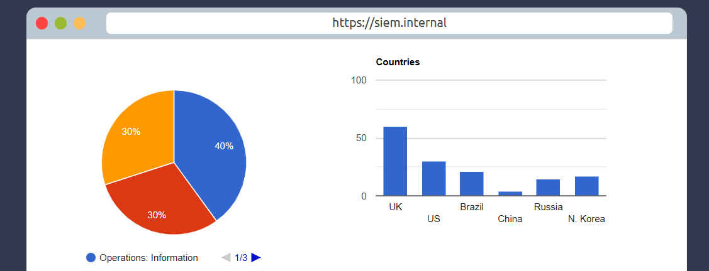
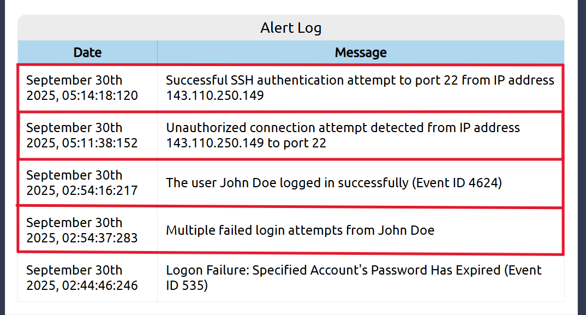
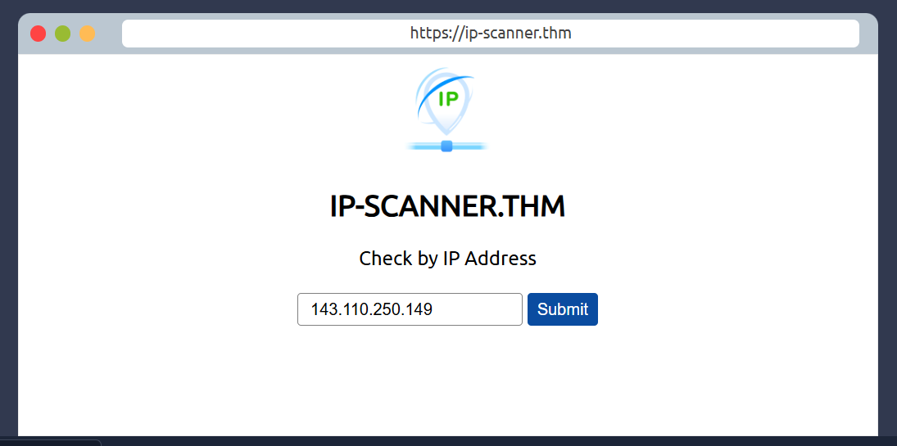
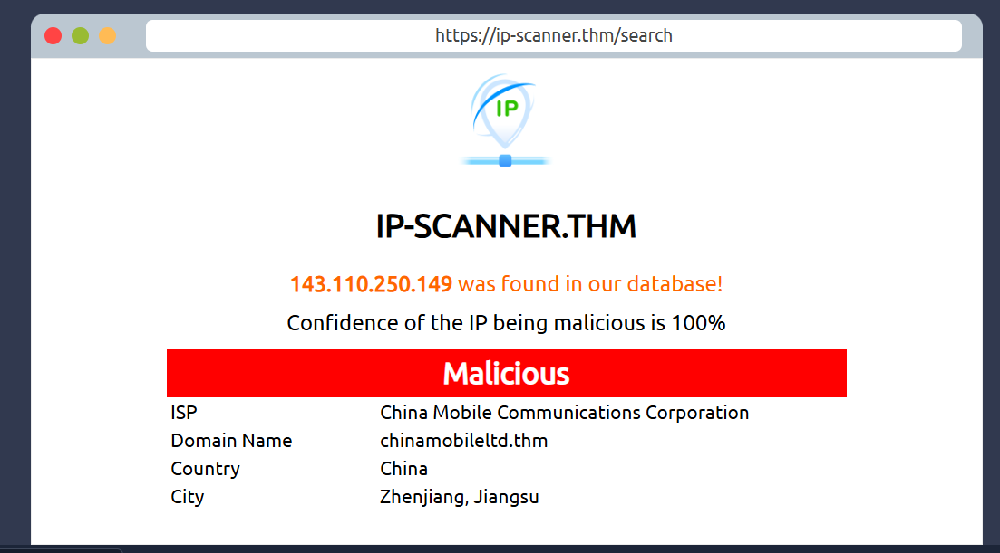
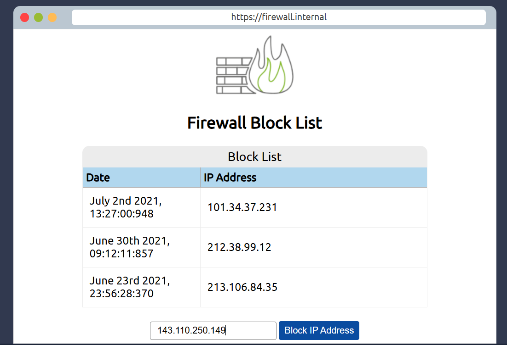

# Room: Intro to Defensive Security  
**Platform:** TryHackMe  
**Difficulty:** Beginner  
**Date Completed:** 30th August 2025 

## 🔑 Key Learnings

This room was a solid introduction to what defensive security is all about. Unlike offensive roles where you're breaking into systems, defensive security focuses on protecting them. I went through the basics of what blue teamers do, how a SOC (Security Operations Center) works, and what tools are commonly used to detect and respond to threats.

Some key takeaways:
- Defensive security is more than just reacting, it's about being prepared and proactive.
- Learned the difference between things like IDS and IPS, and how logs play a massive role in detecting attacks.
- Got a better understanding of the daily workflow in a SOC and how they handle alerts.

## 🛠 Tools and Concepts Covered

- **SIEMs** – tools like Splunk or ELK that help collect and analyze logs.
- **Log analysis** – looking at failed login attempts, strange IPs, or unusual behavior.
- **SOC roles** – how analysts triage alerts and respond to incidents.
- Basic overview of **firewalls**, **IDS/IPS**, and general network defense layers.

## Screenshots as an evidence of completion/How I did it.

- I first made a login into my model of siem dashboard like this:

- I checked the activity or alert log for malicious activities and found some:

- Then I scanned the malicious IP address given in the log. There are many IP checkers like AbuseIPDB and Cisco Talos Intelligence. But here, I used given model IP scanner:

- I found that this user is unfamiliar and a malicious actor who is trying to sabotage our system:

- I reported that actor to my staff member. So, as soon as I got the permission to put the IP address of the actor in firewall block list, I did it:

## 🔍 How Threats Are Detected

One of the more interesting parts was seeing how defenders actually detect suspicious behavior using logs. For example, if a user fails to log in 50 times in 2 minutes, that’s a red flag. SIEMs help flag that kind of activity automatically.

Here’s how the general process works:
- Logs are collected from different systems (servers, apps, firewalls, etc.).
- SIEM rules check for abnormal behavior.
- If something looks off, it creates an alert.
- Analysts review the alert to decide if it’s a real threat or a false positive.

This really showed me how important good logging and visibility are. Without logs, defenders are basically blind.

## 📝 Personal Notes

I’ve mostly been focused on the offensive side of cybersecurity so far, but this gave me a whole new appreciation for the blue team. Defenders don’t just sit around waiting for alerts — there’s a lot of strategy involved in building strong defenses and spotting subtle signs of attacks.

Also realized how much attackers rely on defenders being lazy or misconfigured — things like missing logs, open ports, weak alerting rules. Every gap is an opportunity for attackers.

Now I understand that:
*“You can’t defend what you don’t understand.”*

---

