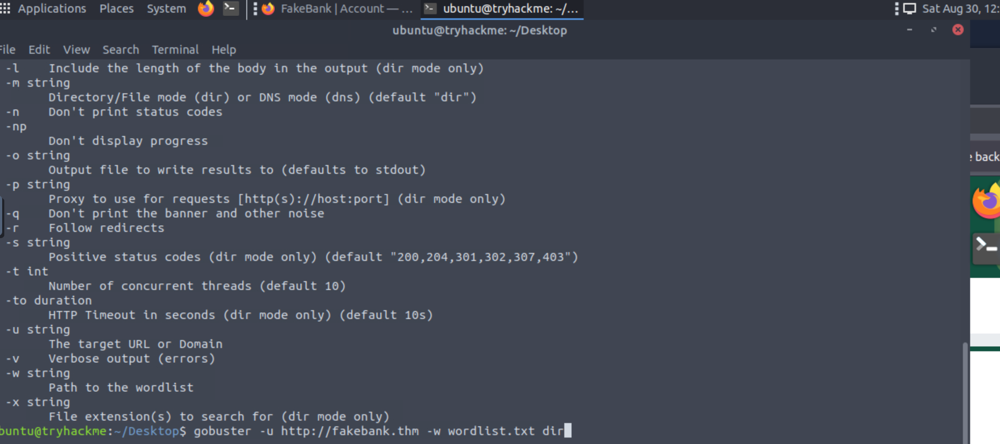
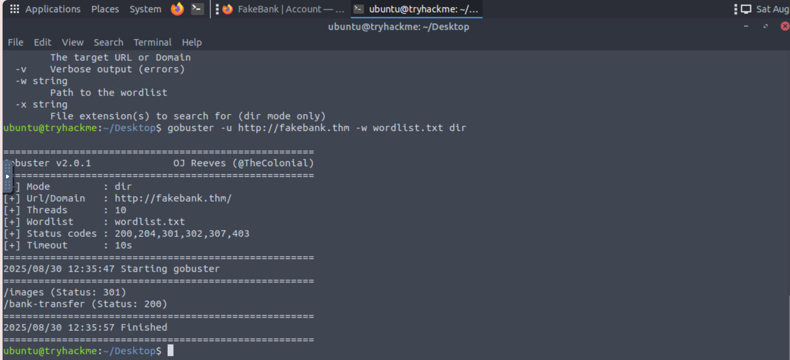
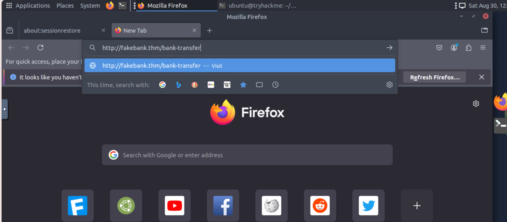
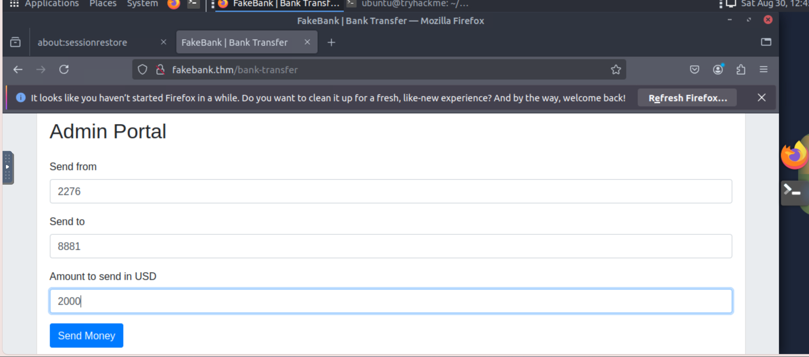

# Room: Intro to Offensive Security
**Platform:** TryHackMe  
**Difficulty:** Beginner  
**Date Completed:** 30th August 2025  

---

## 🔑 Key Learnings
- Offensive security = understanding the mindset of an attacker.  
- Learned basic phases: **Reconnaissance → Scanning → Exploitation → Reporting**.  
- Difference between **ethical hacking** and malicious hacking.  

---

## 🛠 Tools / Concepts Used
- Reconnaissance techniques (what info to gather about target)  
- Gobuster tool (scanning for hidden directories)  

---

## 📌 How I found hidden directories with Gobuster
- First, I opened the terminal in Linux running in the VM. Then, I typed the command for Gobuster given below:
<pre> gobuster -u http://fakebank.thm -w wordlist.txt dir </pre>
The '-u' attribute is used to specify the url on which we will perform exploitation. And '-w' is used to specify the wordlist that the Gobuster will use to match found directories with ones in the wordlist.

- Now our Gobuster has started checking wether the hidden directories will get matched with the ones on the wordlist or not.

- Our Gobuster found some hidden directories that matched with the ones in the wordlist. In our case, '/bank-transfer' and '/images'.

- Since the page that sounds useful is '/bank-transfer', so we will type it in our browser.

- And here, we have finally found the vulnerability in the bank's website.
*Used Gobuster in VM to scan hidden directories, learned how attackers find hidden vulnerabilities.*

---

## 📝 Personal Notes
- Offensive + defensive balance is important.  
- I now understand the “attacker mindset” and how to defend systems better.  
- Quote I liked: *"To protect yourselves from a hacker, you must think like one."*

