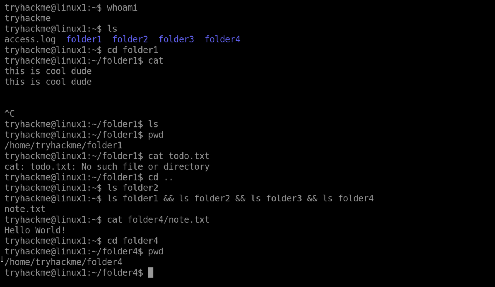
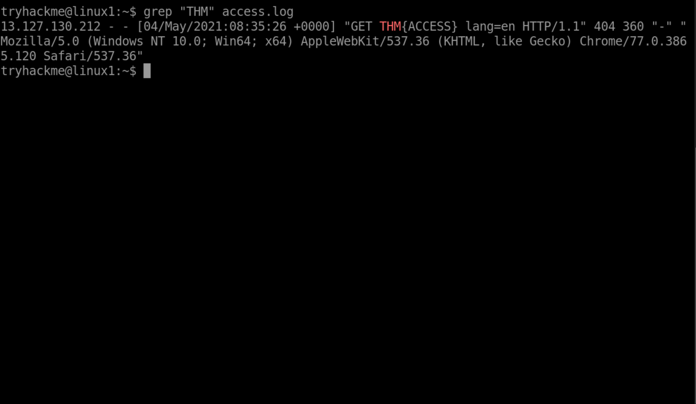

# Room: Linux Fundamentals Part 1  
**Platform:** TryHackMe  
**Difficulty:** Beginner  
**Date Completed:** 27th September 2025  

## 🗒️ Room Summary
This room introduced me to the basics of the Linux operating system. I learned how to navigate through files and directories using the terminal, and also how Linux is different from other operating systems like Windows. It was my first step into actually using Linux commands instead of just reading about them.

## 🔑 Key Takeaways
- Linux is built on a directory structure that starts from the root (`/`).  
- I practiced moving around directories with `cd`, listing files with `ls`, and checking my location with `pwd`.  
- I learned how to read files using `cat`.  
- I also learnt how to find files from directories instead of scanning one by one, I used `find`.
- I also learnt how to type things into a text file using combination of `echo`, `> and >>`.
- I learnt the difference between `&` and `&&`.

## 🖥️ Practical Learning
Most of the tasks were hands-on in the terminal. I had to explore directories, open files, and figure out answers by actually using commands instead of guessing. This made me more comfortable with typing commands and understanding the output.  

## Some screenshots here
- Here I used many commands:

- Here I also have used the `grep` command:
  

## Why this matters
Linux is the backbone of most servers and security environments. If I want to work in cybersecurity, I need to be comfortable in Linux. This room gave me a strong start, and I can already see how important it will be for everything I do next.
