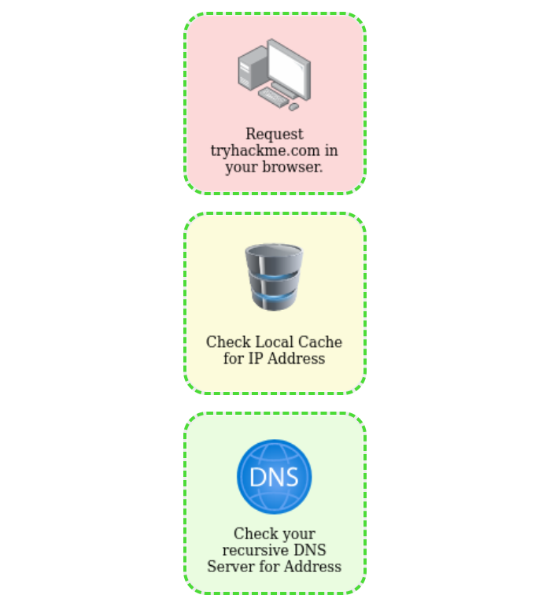
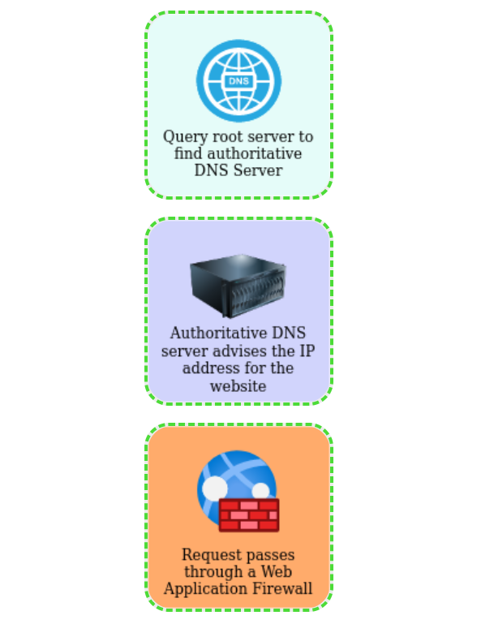
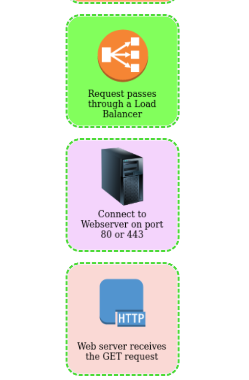

# Room: Putting It All Together  
**Platform:** TryHackMe  
**Difficulty:** Beginner  
**Date Completed:** 27th September 2025  

## 🗒️ Room Summary
This room was all about connecting the concepts from the “How the Web Works” section. I already learned about DNS, HTTP, and how websites are structured, but here everything was combined so I could see the full process of how the web actually works behind the scenes.

## 🔑 Key Takeaways
When I type a URL into the browser, a DNS query finds the server’s IP address.  
The browser then makes an HTTP request, which travels through the network, and the server responds with the web page.  
Every step in between: DNS, HTTP, packets, and responses, works together to make websites function.  

## 🖥️ Practical Learning
The exercises helped me trace a request from start to finish. I could see how a simple action like visiting a page actually relies on multiple layers working together, from DNS resolution to the server sending back data. It made the theory feel more real.  

## Some screenshots here
- The built-in 'quiz' type thingy helped me grasp the concept of how a user request is proccessed:

- The second part of the same exercise:

- The third part of the same exercise:
    

## Why this matters
This room gave me the “big picture” of how the internet works. It connected all the small pieces I studied earlier into one flow. For cybersecurity, this is very important because attackers often exploit weak points in this process. Understanding the web step by step means I can secure it better in the future.
