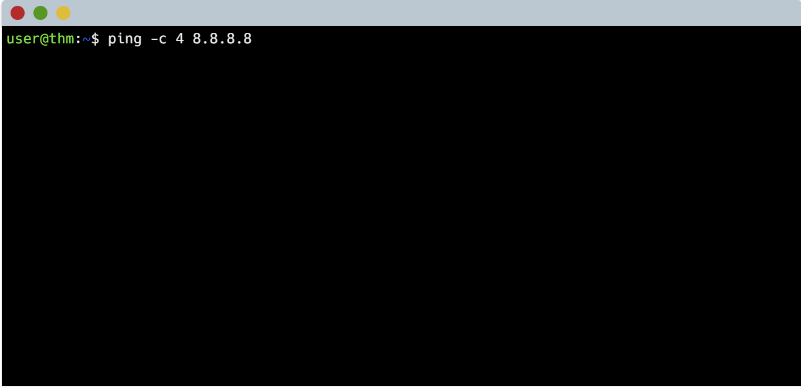
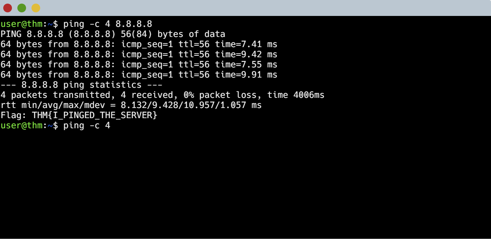

# What is Networking? 🌐

## Room Summary
This TryHackMe room explained the basics of networking and how computers talk to each other and how the internet works. I learned about IP addresses, MAC addresses, and ports, and how they all connect to make communication possible.  

## Key Takeaways
IP addresses are like a home address for devices.  
MAC addresses are unique hardware IDs that never change.  
Ports are like doors that let services and apps talk to each other, for example port 80 for websites.  
Protocols are the rules of communication, like TCP and UDP.  

## Hands-On Practice
I used the `ipconfig` / `ifconfig` commands to check my device’s network details.  
I used `ping` to see if a device is reachable.  
I also learned how data is broken into packets, sent across the network, and put back together.  

## How I tried the ping command on the VM  
- I first typed in the command:
<pre> ping -c 4 8.8.8.8</pre>  
We used the ping command and we declared that we will conduct 4 pings on the target 8.8.8.8.
  
- Now we have the result. The total time taken was 4006ms. And the average was 9.428ms.
 

## Why practice matters
Networking is the backbone of cybersecurity. Without knowing IPs, ports, and protocols, you can’t secure or attack systems. This room gave me my first real step toward understanding how devices connect and how I can analyze traffic or defend against threats.
